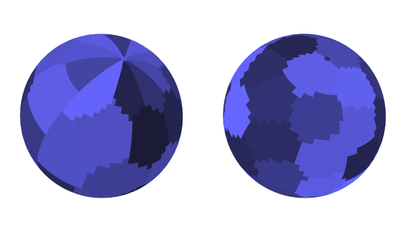

```{r, echo=FALSE}
knitr::opts_chunk$set(comment = NA)
```


## Introduction


The **spcosa**-package implements algorithms for

1. spatial coverage sampling and 
1. random sampling from compact geographical strata.

These algorithms are based on the _k_-means algorithm (de Gruijter _et al._, 2006, Walvoort _et al._, 2010).

Spatial coverage sampling is known to be an efficient sampling method for model-based mapping (kriging). Random sampling from compact geographical strata is recommended for design-based estimation of spatial means, proportions, etc.

In this vignette, the usage of the package will be demonstrated by means of several examples.


## Initialisation

The **spocsa**-package can be attached by means of

```{r}
library(spcosa)
```
In addition, we will also attach the **ggplot2**-package for modifying plots:
```{r}
library(ggplot2)
```


Although the implemented optimisation algorithms are deterministic in nature, they use a user-specified number (`nTry`, see examples below) of random initial configurations to reduce the risk of ending up in an unfavourable local optimum. In order to be able to reproduce the sampling patterns at a later stage, the pseudo random number generator of **R** has to be initialised first:
```{r}
set.seed(314)
```
The **spcosa**-package depends on the **sp**-package (Pebesma & Bivand, 2005) for
storing spatial information, and the **ggplot2**-package (Wickham, 2009) for visualisation. A basic knowledge of the [**sp**-package](https://cran.r-project.org/package=sp) is highly recommended. Knowledge of the **ggplot2**-package is only needed for fine-tuning **spcosa** graphics. Consult the superb [ggplot2-website](https://ggplot2.tidyverse.org) for details and illustrative examples.


## Algorithms

The basic idea is to distribute sampling points evenly over the study area by selecting these points in compact spatial strata (a.k.a. geostrata). Compact strata can be constructed by _k_-means clustering of the points making up a fine grid representing the study area of interest. Two _k_-means algorithms have been implemented in the **spcosa**-package: a transfer algorithm and a swopping algorithm (Walvoort _et al_, 2010). The transfer algorithm obtains compact clusters (strata) by transferring cells from one cluster to the other, whereas the swopping algorithm achieves this by swopping cells between clusters. The first algorithm results in compact clusters, whereas the second algorithm results in compact clusters of equal size. For reasons of efficiency, both algorithms have been implemented in the [Java](https://www.java.com) language and communicate with **R** (R Core Team, 2015) by means of the **rJava**-package (Urbanek, 2013).


## Examples

In this section, the **spcosa**-package will be demonstrated by means of several examples.


### Spatial coverage sampling without prior points

First, a vector or raster representation of the study area has to be created that uses one of the spatial classes of the **sp**-package (Pebesma & Bivand, 2005). This can be accomplished by means of functions in the **rgdal**-package (Bivand _et al._, 2015). In this section, we simply create a grid programmatically.

```{r, message=FALSE}
library(sp)
grd <- expand.grid(s1 = 1:100, s2 = 1:50)
gridded(grd) <- ~ s1 * s2
```

To obtain a uniform distribution of sampling points over the study area, the sampling points will be selected at the centroids of compact spatial strata. Compact strata can be constructed by invoking the `stratify` method:

```{r}
stratification <- stratify(grd, nStrata = 75, nTry = 10)
```
In this example, the study area has been partitioned into 75 compact strata. The resulting stratification can be plotted by means of:

```{r, fig.width=7, fig.height=4, out.width=500}
plot(stratification)
```

Each plot can be modified by adding **ggplot2**-functions to the `plot`-method:

```{r, fig.width=7, fig.height=4, out.width=500, message=FALSE}
plot(stratification) +
    scale_x_continuous(name = "Easting (km)") +
    scale_y_continuous(name = "Northing (km)")
```

The `spsample`-method, an overloaded method from the **sp**-package, can be used for selecting the centroid of each stratum:

```{r}
sampling_pattern <- spsample(stratification)
```


The `plot`-method can be used to visualise the resulting sampling pattern:

```{r, fig.width=7, fig.height=4, out.width=500}
plot(sampling_pattern)
```

The sampling pattern can also be plotted on top of the stratification:

```{r, fig.width=7, fig.height=4, out.width=500}
plot(stratification, sampling_pattern)
```

The resulting sampling locations can be extracted by means of a simple type cast to class `data.frame`:
```{r}
sampling_points <- as(sampling_pattern, "data.frame")
head(sampling_points)
```


### Spatial coverage sampling with prior points

Sometimes, samples from previous sampling campaigns are available. In these situations, spatial infill sampling may be performed. This type of spatial coverage sampling aims to distribute new sampling points evenly over the study area, while taking the locations of existing sampling points into account. Suppose a `data.frame` is available containing the coordinates of 50 existing sampling points:

```{r, echo=FALSE}
prior_points <- spsample(grd, n = 50, type = "random")
prior_points <- as(prior_points, "data.frame")
names(prior_points) <- c("s1", "s2")
```

```{r}
head(prior_points)
```

Twenty-five _new_ points can be assigned to sparsely sampled regions by means of:
```{r}
coordinates(prior_points) <- ~ s1 * s2
stratification <- stratify(grd, priorPoints = prior_points, nStrata = 75, nTry = 100)
sampling_pattern <- spsample(stratification)
```
Note that the total number of strata, and therefore the total number of points, equals 50+25=75. In addition, also note that the `nTry` argument has been set to 100. The algorithm will now use 100 random starting configurations and keeps the best solution to reduce the risk of ending up in an unfavourable local optimum.

```{r, fig.width=7, fig.height=4, out.width=500}
plot(stratification, sampling_pattern)
```

Note that prior points and new points are represented by different symbols.


### Random sampling from compact geographical strata

In this section, the global mean clay and organic matter contents of the study area will be estimated by means of stratified simple random sampling. We will use grid `grd` (created in a previous section) as a representation of the study area.
The study area will be partitioned into 25 compact strata:

```{r}
stratification <- stratify(grd, nStrata = 25, nTry = 10)
```

```{r, fig.width=7, fig.height=4, out.width=500}
plot(stratification)
```

The `spsample`-method can be used to randomly sample two sampling units per stratum:
```{r}
sampling_pattern <- spsample(stratification, n = 2)
```

```{r, fig.width=7, fig.height=4, out.width=500}
plot(stratification, sampling_pattern)
```

Sampling points can be extracted by means of a type cast to class `data.frame`:

```{r}
sampling_points <- as(sampling_pattern, "data.frame")
head(sampling_points)
```
Next, some field and laboratory work has to be done. Suppose the resulting clay and SOM contents are stored in `data.frame` `my_data` (note that in this example we use simulated data):

```{r}
my_data <- data.frame(clay = rbeta(50, 2, 25), SOM = rbeta(50, 1, 50))
head(my_data)
```
The spatial mean clay and soil organic matter contents can be estimated by (de Gruijter _et al._, 2006):

```{r}
estimate("spatial mean", stratification, sampling_pattern, my_data)
```
In estimating the spatial mean, differences in surface area of the strata are taken into account. Note, that the spatial mean is estimated for all columns in `my_data`. The standard error can be estimated in a similar way:
```{r}
estimate("standard error", stratification, sampling_pattern, my_data)
```
The spatial cumulative distribution function (SCDF) (see de Gruijter _et al._, 2006) can be estimated by means of
```{r}
scdf <- estimate("scdf", stratification, sampling_pattern, my_data)
```
The SCDFs are returned as a list of matrices, _i.e._ one matrix for each property:
```{r}
head(scdf$clay)
head(scdf$SOM)
```
The SCDFs for clay and SOM are visualised below.

```{r, fig.width=6, fig.height=5, out.width=400, echo=FALSE}
tmp <- as.data.frame(scdf$clay)
tmp$value <- tmp$value * 0.01
dx <- mean(diff(tmp$value))
dat <- data.frame(
    x = c(tmp$value[1] - dx, tmp$value),
    xend = c(tmp$value, tmp$value[nrow(tmp)]+ dx),
    yend =  c(tmp$cumFreq, 1)
)
ggplot() +
    geom_segment(data = dat, mapping = aes(x = x, y = yend, xend = xend, yend = yend)) +
    geom_point(data = dat[-1, ], mapping = aes(x = x, y = yend), shape = 16) +
        scale_x_continuous(name = "x : clay content (g/dag)") +
        scale_y_continuous(name = "cumulative frequency")
tmp <-  unique(as.data.frame(scdf$SOM))
tmp$value <- tmp$value * 0.01
dx <- mean(diff(tmp$value))
dat <- data.frame(
    x = c(tmp$value[1] - dx, tmp$value),
    xend = c(tmp$value, tmp$value[nrow(tmp)]+ dx),
    yend =  c(tmp$cumFreq, 1)
)
ggplot() +
    geom_segment(data = dat, mapping = aes(x = x, y = yend, xend = xend, yend = yend)) +
    geom_point(data = dat[-1, ], mapping = aes(x = x, y = yend), shape = 16) +
    scale_x_continuous(name = "x : soil organic matter content (g/dag)") +
    scale_y_continuous(name = "cumulative frequency")
```


### Stratified simple random sampling for composites

In this example, the aim is to estimate the global mean clay and organic matter contents of a field. To reduce laboratory costs, the soil aliquots collected at the sampling locations will be bulked into composite samples. The study area is a field near the village of Farmsum, in the North-East of the Netherlands. An ESRI shape file of this field is available in the `maps` directory of the **spcosa**-package. It can be loaded by means the `readOGR`-function in the **rgdal** package (Bivand _et al._, 2015):

```{r}
library(rgdal)
directory <- system.file("maps", package = "spcosa")
shp_farmsum <- readOGR(dsn = directory, layer = "farmsum", verbose = FALSE)

```
First, the field will be stratified into, say, 20 compact strata of equal size. Strata of equal size are desirable to simplify fieldwork, _i.e._ equal supports of soil can be collected at the sampling locations (Brus _et al._, 1999, de Gruijter _et al._, 2006).


```{r, fig.width=6, fig.height=6, out.width=400}
stratification <- stratify(shp_farmsum, nStrata = 20, equalArea = TRUE, nTry = 10)
plot(stratification)
```

Next, two sampling units will be selected at random in each stratum. At least two
sampling units per stratum are required to estimate the sampling variance of the estimated mean.


```{r, fig.width=6, fig.height=6, out.width=400}
sampling_pattern <- spsample(stratification, n = 2, type = "composite")
plot(stratification, sampling_pattern)
```

Sampling points can be extracted means of:
```{r}
sampling_points <- as(sampling_pattern, "data.frame")
head(sampling_points)
```
Note that an extra column has been added specifying the sampling units to be bulked into each composite. A composite sample is formed by bulking one aliquot (sampling unit) per stratum. Field work now results in a composite sample of size two. These data will be stored in a `data.frame` called `my_data`:

```{r, echo=FALSE}
my_data <- data.frame(
  clay = c(9.7, 10.4),
  SOM = c(4.9, 5.2)
)
```
The spatial mean and its standard error can be estimated by means of:
```{r}
estimate("spatial mean", stratification, sampling_pattern, my_data)
estimate("standard error", stratification, sampling_pattern, my_data)
```
If we do not want to bulk soil aliquots, the same stratification can be used to select a sample of 20 $\times$ 2 sampling locations:
```{r}
sampling_pattern <- spsample(stratification, n = 2)
sampling_points <- as(sampling_pattern, "data.frame")
head(sampling_points)
```

```{r, fig.width=6, fig.height=6, out.width=400}
plot(stratification, sampling_pattern)
```


## Special cases


### Map projections

When the projection attribute of a map is set to EPSG:4326 (lon/lat), [great circle distances](https://en.wikipedia.org/wiki/Great-circle_distance) will be used for stratification. Otherwise, Euclidean distances will be used. At field scale, the differences between these distance measures is rather small. However, at continental and global scales, the projection attribute should be set to EPSG:4326.

To illustrate the effect of stratification on smaller spatial scales, consider two (relatively coarse) regular grids covering the surface of the earth:
```{r}
grd <- expand.grid(
    longitude = seq(from = -176, to = 180, by = 4),
    latitude  = seq(from =  -86, to =  86, by = 4)
)
gridded(grd) <- ~ longitude * latitude

grd_crs <- grd
slot(grd_crs, "proj4string") <- CRS("EPSG:4326")

```
Note that `grd` is identical to `grd_crs`, except for projection attribute \code{CRS("EPSG:4326")}.

Both grids will be partitioned into 50 compact geographical strata:
```{r}
strata     <- stratify(grd,     nStrata = 50)
strata_crs <- stratify(grd_crs, nStrata = 50)
```

```{r, fig.width=8, fig.height=5, out.width=500}
plot(strata)
plot(strata_crs)
```

Note that `grd` seems to have more compact strata near the geographic poles than `grd_crs`. However, the contrary is true. This becomes evident when both stratifications are projected on a sphere:



The left figure is based on `grd`, and the right figure on `grd_crs`. The strata of `grd_crs` are clearly more compact than those of `grd`. In addition, `grd` suffers from pronounced edge effects near the poles and at 180 degrees longitude. The strata are discontinuous at this meridian, _i.e._, two points on opposite sides of the meridian are treated as very distant when squared Euclidean distances are used. The strata of `grd_crs`, on the other hand, have been optimised on a sphere by using squared great circle distances, and don't suffer from edge effects, _i.e._, the great circle distance between two nearby points on opposite sides of this meridian is small.


### Simple random sampling

Although the **spcosa**-package is about sampling from compact strata, it can also be used for simple random sampling, by setting `nStrata = 1`:

```{r}
shp_mijdrecht <- readOGR(
    dsn = system.file("maps", package = "spcosa"), 
    layer = "mijdrecht", verbose = FALSE)
stratification <- stratify(shp_mijdrecht, nStrata = 1, nGridCells = 5000)
sampling_pattern <- spsample(stratification, n = 30)
```

```{r, fig.width=5, fig.height=7, out.width=300}
plot(stratification, sampling_pattern)
```


### Sampling of non-convex areas

In case of spatial coverage sampling, sampling the centroid of each cluster may become problematic in case of non-convex areas. A centroid may be situated well outside the area of interest. If this happens, the sampling point will be relocated to the nearest grid cell that is part of the target universe. This pragmatic solution usually gives reasonable results. However, in some extreme situations the solution may be less desirable. As an example, consider the 'doughnut'-shaped field below.

```{r}
doughnut <- expand.grid(s1 = -25:25, s2 = -25:25)
d <- with(doughnut, sqrt(s1^2 + s2^2))
doughnut <- doughnut[(d < 25) & (d > 15), ]
coordinates(doughnut) <- ~ s1 * s2
gridded(doughnut) <- TRUE
```

```{r, fig.width=5, fig.height=5, out.width=350}
stratification <- stratify(doughnut, nStrata = 2, nTry = 100)
sampling_pattern <- spsample(stratification)
plot(stratification, sampling_pattern)
```

Note that this problem does not arise in random sampling from compact geographical strata.


## Session information

```{r, echo=FALSE}
sessionInfo()
```


## References

- Bivand, R.,  T. Keitt and B. Rowlingson (2015). rgdal: Bindings for the Geospatial Data
  Abstraction Library. R package version 0.9-2. https://cran.r-project.org/package=rgdal

- Brus, D.J.,  L. E. E. M. Sp&auml;tjens, J.J. de Gruijter (1999).A sampling scheme for estimating the mean extractable phosphorus concentration of fields for environmental regulation. Geoderma 89: 129-148

- de Gruijter, J., D. Brus, M. Bierkens & M. Knotters (2006). Sampling for Natural Resource Monitoring. Springer Berlin

- Diggle, P.J. & Ribeiro Jr, P.J. Model Based Geostatistics Springer, New York, 2007

- Pebesma, E.J., R.S. Bivand, 2005. Classes and methods for spatial data in R.
  R News 5 (2), https://cran.r-project.org/doc/Rnews/Rnews_2005-2.pdf 

- R Core Team (2015). R: A language and environment for statistical computing. R Foundation for
  Statistical Computing, Vienna, Austria. URL https://www.r-project.org/.
  
- Urbanek, S. (2013). rJava: Low-level R to Java interface. R package version 0.9-6.
  https://cran.r-project.org/package=rJava
  
- Venables, W. N. & Ripley, B. D. (2002) Modern Applied Statistics with S. Fourth Edition.
  Springer, New York. ISBN 0-387-95457-0

- Walvoort, D. J. J., Brus, D. J., and de Gruijter, J. J. (2010) An R package for spatial
  coverage sampling and random sampling from compact geographical strata by k-means
  Computers & Geosciences 36: 1261-1267 Available online at
  https://dx.doi.org/10.1016/j.cageo.2010.04.005

- Wickham, H (2009). ggplot2: elegant graphics for data analysis. Springer New York
